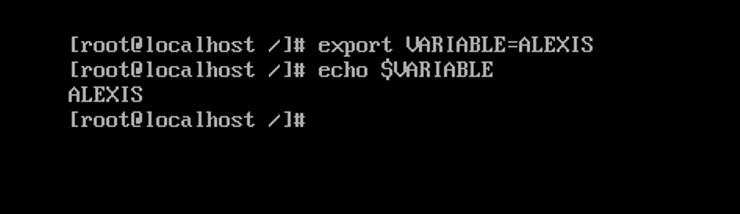
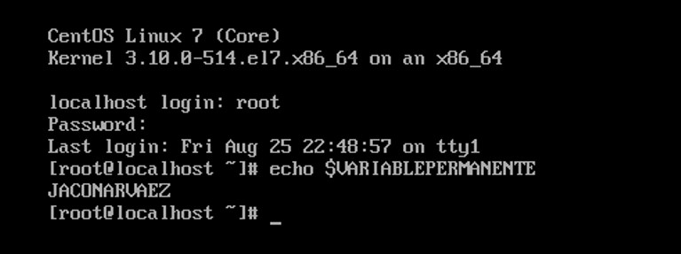

### Taller 1
**Universidad ICESI**  
**Curso:** Sistemas Operativos  
**Estudiante:** Joan Alexís Córdoba Narváez.  
**Código:** A00232548.  
**Correo:** alexiscord@hotmail.com

### Descripción
En este taller he afianzado conocimiento acerca de las funciones y utilidades de los directorios principales del sistema. También he aprendido un poco sobre las variables de entorno y la diferenciación en el manejo de ellas en cuanto a la duración dentro del sistema (permanente o volátil). La investigación sobre los comandos ha sido de gran utilidad haciendo de ellos una herramienta más al momento de utilizar este tipo de sistemas operativos.

### Solución.

1. Explique la función de los directorios en la raíz de sistema operativo Linux-CentOS.
Proporcione ejemplos de los archivos que se encuentran en cada directorio (explique al menos un
archivo por directorio).

| Directorio   | Archivo ejemplo | Descripción del contenido del directorio  |
|------|------|------|
| /bin | grub2-mkfont | Las aplicaciones relacionadas con el sistema se encuentran en este directorio. Algunas aplicaciones instaladas manualmente también se almacenan aquí. |
| /sbin | load-policy | Las tareas especializadas se encuentran en scripts o aplicaciones especiales y se pueden encontrar en este directorio. |
| /lib | modules-load.d | Las librerías y/o algoritmos  que comparten varias (si no la mayoría de) aplicaciones están almacenadas aquí. Estas ayudan a reducir el espacio usado en disco y a mejorar el tiempo de ejecución de las aplicaciones.  |
| /etc | init.d | En cuanto a servicios, los archivos y carpetas que contienen la configuración de estos, se pueden encontrar aquí. |
| /home | directorio "operativos" | Los archivos y directorios de los usuarios del sistema se encuentran aquí. |
| /mnt | En el caso de mi VM, el directorio está vacío. | Las unidades de almacenamiento tales como los CDs se montan en este directorio. |
| /var | .updatedi | Los registros y cambios de información en bases de datos se encuentran ubicadas en este directorio. Estos se encuentran en constante cambio. |
| /boot | initrd-plymouth.img | Los archivos con la configuración de arranque y los nucleos, se encuentran en este directorio. |
| /dev | network-latency | Los archivos de configuración de los periféricos se encuentran en este directorio. |
| /media | En el caso de mi VM, el directorio está vacío. | Las particiones cargadas de disco duro y algunos dispositivos como cámaras, se encuentran aquí. |
| /opt | En el caso de mi VM, el directorio está vacío. | Las aplicaciones de terceros pueden ser instaladas aquí. |
| /proc | cgroups | Los procesos en ejecución o en pausa se pueden encontrar en este directorio. |
| /root | infra.db | El directorio del superusuario. |
| /sys | module/ip_set | Los archivos del sistema se encuentran aquí. |
| /tmp | .font-unix | Los archivos y configuraciones temporales se pueden encontrar aquí. |

2. En una tabla como se muestra a continuación escriba 10 comandos de Linux no visto en clase. Puede incluir comandos que funcionan una vez han sido instalados con yum

| Comando   | Usuario | Descripción   |
|------|------|------|
| $ time cat | Cualquier usuario | Es un cronómetro en terminal que al correrlo el cursor de la terminal queda estático y cuando lo interrumpimos con Ctrl + C, muestra el tiempo que duró ejecutándoce|
| $ yes | Cualquiera | Imprime un bucle infinito de texto "Y" o cualquier texto que le siga despues del comando: $yes soy el mejor |
| $ rev | Cualquiera | Una vez ejecutado podremos ingresar un texto que él imprimirá al revés. Si escribimos ALEXIS, imprimirá SIXELA |
| $ factor | Cualquiera | Una vez ejecutado podremos ingresar un número y el mostrará su descomposición en factores primos. |
| $ tar | Cualquiera | Nos ayuda a descomprimir archivos tales como ZIP, RAR, etc. |
| $ iconv -l | Cualquiera | Lista los cifrados conocidos |
| $ find | Cualquiera | Ayuda a buscar archivos |
| $ which halt | Cualquiera | Muestra la direccióm completa del archivo binario ejecutable halt |
| $ whereis halt | Cualquiera | Muestra la ubicación del fichero binario de ayuda o fuente, en este caso halt |
| $ df -h | Cualquiera | Muestra una lista de particiones montadas |

3. ¿Cuál es la utilidad del comando printenv en Linux?, Investigue acerca de la creación de variables de ambiente en Linux y como hacerlas permanentes. Cree una variable de ambiente, hágala permanente y muestre evidencias del funcionamiento.  

$printenv: Imprime todo lo que hace parte del entorno, entre ello, las variables de entorno creadas manualmente o las que viene por defecto en el sistema. 

Para crear una variable de entorno se toma el comando export junto con e nombre de la variable (MAYÚSCULAS) y su definición. Ejemplo:
$export MIVARIABLE=ALEXIS.  

Para crear una variable de entorno permanente, editamos el archivo etc/environment y escrbimos con el mismo formato anterior, el nombre de la variable y su valor. 

## Referencias

* http://www.sysadmit.com/2016/04/linux-variables-de-entorno-permanentes.html
* https://www.computerhope.com/unix/printenv.htm
* https://blog.desdelinux.net/9-comandos-combinaciones-muy-divertidos-e-inutiles-de-linux/
* https://www.emezeta.com/articulos/20-curiosidades-geeks-para-terminales-linux
* https://help.ubuntu.com/kubuntu/desktopguide/es/directories-file-systems.html
* https://blog.desdelinux.net/9-comandos-combinaciones-muy-divertidos-e-inutiles-de-linux/
* https://blog.desdelinux.net/9-comandos-combinaciones-muy-divertidos-e-inutiles-de-linux/
* https://blog.desdelinux.net/9-comandos-combinaciones-muy-divertidos-e-inutiles-de-linux/
